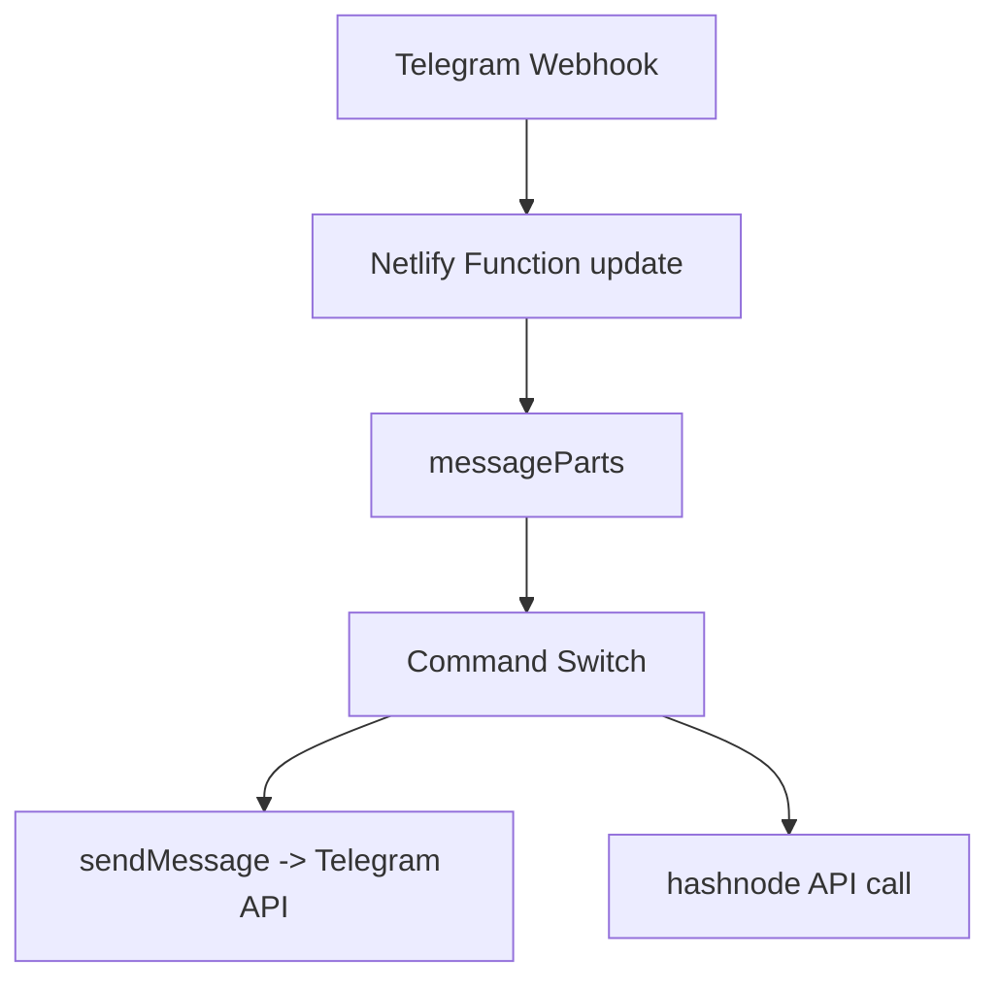
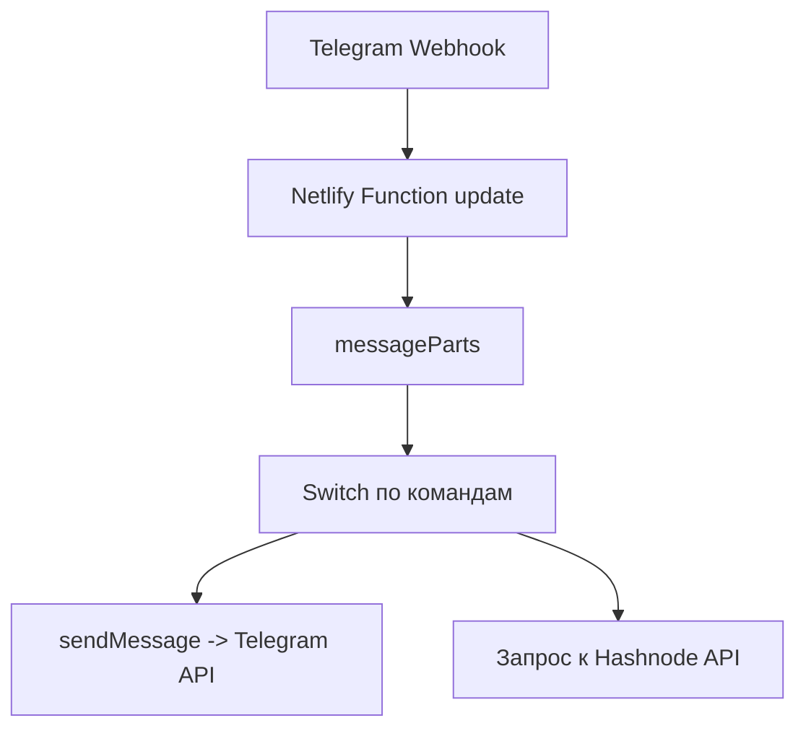

# partiibot
[](https://github.com/DenisArger/TelegramNetlify/actions/workflows/ci.yml)

## English

## Problem
Teams often need a minimal Telegram bot webhook that can be deployed quickly without maintaining a dedicated server.

## Solution
`partiibot` is a Netlify Function-based Telegram bot: it receives webhook updates, parses commands, and replies through Telegram Bot API.

## Tech Stack
- Node.js
- JavaScript (CommonJS)
- Telegram Bot API
- Netlify Functions
- Axios

## Architecture
Top-level structure:
```text
netlify/functions/update.js
messageParts.js
sendMessage.js
hashnode.js
netlify.toml
```



## Features
- Webhook-based Telegram command processing
- Command parsing (`/echo`, `/hashnodefeatured`)
- External API integration example (Hashnode)
- Simple function-first deployment model

## How to Run
```bash
npm install
cp .env.example .env
npx netlify dev
```

Required environment variable: `TELEGRAM_BOT_TOKEN`.

## Русский

## Проблема
Командам часто нужен минимальный Telegram webhook-бот, который можно быстро задеплоить без отдельного сервера.

## Решение
`partiibot` — это Telegram-бот на Netlify Functions: принимает webhook-апдейты, парсит команды и отвечает через Telegram Bot API.

## Стек
- Node.js
- JavaScript (CommonJS)
- Telegram Bot API
- Netlify Functions
- Axios

## Архитектура
Верхнеуровневая структура:
```text
netlify/functions/update.js
messageParts.js
sendMessage.js
hashnode.js
netlify.toml
```



## Возможности
- Обработка Telegram-команд через webhook
- Парсинг команд (`/echo`, `/hashnodefeatured`)
- Пример интеграции с внешним API (Hashnode)
- Простой serverless-подход к деплою

## Как запустить
```bash
npm install
cp .env.example .env
npx netlify dev
```

Обязательная переменная окружения: `TELEGRAM_BOT_TOKEN`.
